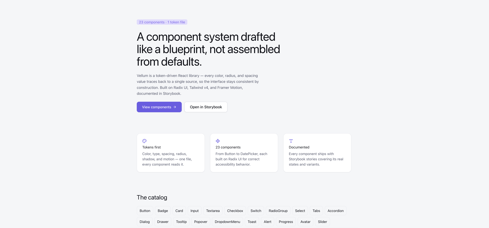

<div align="center">
  <br />

  <p align="center">
  
  </p>

  <h1>🖋️ Vellum</h1>

  <p>
    A precision-drafted React component system.<br/>
    One token file. 23 components. Every visual decision traces back to a single source.
  </p>

  <br />

  <div>
    
    
    
    
    
    
    
    
  </div>
</div>

## 📋 Table of Contents

1. 🤖 [Introduction](#introduction)
2. ⚙️ [Tech Stack](#tech-stack)
3. 🔋 [Features](#features)
4. 🤸 [Quick Start](#quick-start)
5. 🗂️ [Project Structure](#project-structure)
6. 🕸️ [Snippets](#snippets)
7. ♿ [Accessibility](#accessibility)
8. 🧠 [Architecture Notes](#architecture-notes)
9. 🚀 [Deployment](#deployment)
10. 📌 [Known Limitations](#known-limitations)

## <a name="introduction">🤖 Introduction</a>

Vellum is a token-driven component system, not a folder of one-off styled components. Every color, radius, spacing, and type value is defined once — in a single `@theme` block in `app/globals.css` — and every one of the 23 components reads from that same source instead of hardcoding its own pixel values or hex codes. Change a token once, every component that uses it updates, everywhere, automatically.

The project was built to demonstrate the kind of judgment a design-system role actually needs, not just component syntax: a token layer cleanly separated from the component layer, Radix UI primitives under every interactive component for correct keyboard/focus/ARIA behavior instead of hand-rolled a11y, dark mode as a first-class token concern rather than a bolted-on inversion, and — the one that mattered most in practice — catching and fixing a real WCAG contrast failure that only showed up in dark mode, where a token doing double duty (text color *and* solid-fill background) silently dropped white-on-button contrast to 2.57:1. The fix wasn't a hex-value patch; it was splitting the token into two, theme-stable variants for solid fills and theme-adaptive variants for text-on-background. That distinction — and the debugging trail that found it — is the actual point of the project.

## <a name="tech-stack">⚙️ Tech Stack</a>

- **Next.js 16** (App Router) + **TypeScript**
- **React 19**
- **Tailwind CSS v4** — every design token lives in `src/app/globals.css` via `@theme`, not a JS config file
- **Radix UI primitives** — Accordion, Avatar, Checkbox, Dialog, DropdownMenu, Popover, Progress, RadioGroup, Select, Slider, Slot, Switch, Tabs, Toast, Tooltip — correct accessibility behavior under every interactive component
- **Framer Motion** — component-level transitions (Dialog, Drawer mount their content through `AnimatePresence`)
- **GSAP** — the one signature moment: the Token Playground's entrance sequence
- **class-variance-authority + tailwind-merge** — variant styling that can't be silently broken by a caller's `className`
- **Storybook 8** (react-vite) — documentation, live controls, and the Token Playground

## <a name="features">🔋 Features</a>

👉 **23 components** — Button, Badge, Card, Input, Textarea, Checkbox, Switch, RadioGroup, Select, Tabs, Accordion, Dialog, Drawer, Tooltip, Popover, DropdownMenu, Toast, Alert, Progress, Avatar, Slider, DatePicker, Spinner.

👉 **One token file** — color, type scale, spacing, radius, shadow, and motion, all defined once and consumed everywhere via Tailwind v4's `@theme`.

👉 **Dark mode done properly** — every token has a dark counterpart, wired into Storybook's toolbar theme switcher, verified against real WCAG contrast ratios rather than eyeballed.

👉 **Accessible by construction** — every interactive component is a styled Radix primitive: correct keyboard nav, focus trapping, and ARIA wiring out of the box, not re-implemented per component.

👉 **The Token Playground** — a live, interactive Storybook page where scrubbing radius, density, and accent sliders updates real rendered components in real time, with a GSAP-driven entrance sequence. Nothing on that page is a screenshot.

👉 **Zero setup** — no API keys, no required `.env` file, no backend. Clone it and run it.

## <a name="quick-start">🤸 Quick Start</a>

**Prerequisites:** [Node.js](https://nodejs.org/en) and npm.

```bash
git clone https://github.com/jeanrichardson610/vellum.git
cd vellum
npm install
```

Run the landing page:

```bash
npm run dev
```

Open [http://localhost:3000](http://localhost:3000).

Run the component docs (in a separate terminal):

```bash
npm run storybook
```

Open [http://localhost:6006](http://localhost:6006). No environment variables are required for either — see [Deployment](#deployment) for the one optional variable that matters once Storybook is deployed somewhere other than localhost.

## <a name="project-structure">🗂️ Project Structure</a>

```
src/
  app/
    layout.tsx            – root layout, self-hosted Fraunces/Inter/IBM Plex Mono via next/font
    page.tsx               – landing page: hero, pillars, component catalog
    globals.css            – the token file — @theme, dark mode overrides, keyframes
  components/<name>/
    <name>.tsx              – the component, styled with token classes only
    index.ts                – barrel export
    <name>.stories.tsx      – Storybook stories covering real states/variants
  components/index.ts       – top-level barrel — import { Button, Dialog, ... } from "@/components"
  lib/utils.ts               – cn() classname helper
  stories/                   – Foundations pages (Colors, Typography, Spacing & Radius) + Token Playground
.storybook/                  – Storybook config, theme decorator, Google Fonts for the preview iframe
```

## <a name="snippets">🕸️ Snippets</a>

<details>
<summary><code>src/app/globals.css</code> — one token doing two jobs was the actual bug</summary>

`--color-primary-500/600` are retuned lighter in dark mode so they read well as *text* sitting directly on a dark background (links, hover states). Button, Switch, and Checkbox were also reading those same variables for their *solid fill* — which meant white text on a dark-mode button silently dropped to 2.57:1 contrast, failing WCAG AA. The fix: a dedicated trio that stays fixed across both themes, because a filled control's contrast against its own foreground doesn't need to shift with the page background.

```css
/* Retuned per-theme — correct for text sitting on the page background,
   wrong for a solid fill with white text on top. */
--color-primary-500: #6c5ce7;
--color-primary-600: #5a47d6;

/* NOT redefined in [data-theme="dark"] — verified independently to clear
   4.5:1 against white in both themes, because a filled button's contrast
   is self-contained and shouldn't move with the surrounding page. */
--color-primary-solid: #6c5ce7;
--color-primary-solid-hover: #5a47d6;
--color-primary-solid-active: #4835b0;
```

</details>

<details>
<summary><code>src/components/button/button.tsx</code> — white text that can't be silently overridden</summary>

`cn(buttonVariants(...), className)` normally lets a caller's `className` win any conflicting utility — which meant a future `<Button className="text-black">` could regress contrast without anyone noticing. The enforcement class is appended *after* `className` for the three solid-fill variants, so tailwind-merge always resolves the conflict in favor of white:

```typescript
const SOLID_FOREGROUND_WHITE_VARIANTS = new Set(["primary", "ember", "danger"]);

className={cn(
  buttonVariants({ variant, size }),
  className,
  // Appended after className so tailwind-merge always keeps this —
  // a caller can't accidentally drop contrast below the 4.5:1 AA minimum.
  SOLID_FOREGROUND_WHITE_VARIANTS.has(resolvedVariant) && "text-white"
)}
```

</details>

<details>
<summary><code>src/components/dialog/dialog.tsx</code> — Radix's open state, tracked in React so Framer Motion can animate the exit</summary>

Radix's `Dialog.Root` manages open/closed internally; Framer Motion's `AnimatePresence` needs to control mounting itself to animate an exit. Wrapping Root to also track open state in React (controlled or uncontrolled) lets `AnimatePresence` drive the exit animation while Radix still owns focus-trapping and ARIA:

```tsx
const DialogOpenContext = React.createContext(false);

export function Dialog({ open, defaultOpen, onOpenChange, ...props }) {
  const [uncontrolledOpen, setUncontrolledOpen] = React.useState(defaultOpen ?? false);
  const isControlled = open !== undefined;
  const actualOpen = isControlled ? open : uncontrolledOpen;

  return (
    <DialogOpenContext.Provider value={actualOpen}>
      <DialogPrimitive.Root open={actualOpen} onOpenChange={handleOpenChange} {...props} />
    </DialogOpenContext.Provider>
  );
}

// In DialogContent:
const open = React.useContext(DialogOpenContext);
return <AnimatePresence>{open && <DialogPrimitive.Portal forceMount>…</DialogPrimitive.Portal>}</AnimatePresence>;
```

</details>

## <a name="accessibility">♿ Accessibility</a>

- Every interactive component (Dialog, Dropdown, Select, Tabs, Tooltip, and the rest) is a styled **Radix UI primitive**, not a hand-rolled implementation — keyboard navigation, focus trapping, and ARIA attributes come from the primitive, not from re-derived component logic.
- Contrast was **computed, not eyeballed**: every button/switch/checkbox foreground-on-fill pairing was checked against actual WCAG luminance ratios, in both themes, after a real failure surfaced in dark mode (see [Snippets](#snippets)).
- `:focus-visible` is styled explicitly across the token file, not left to inconsistent browser defaults.
- `prefers-reduced-motion` collapses all animation durations to near-zero via a single media query in the base layer — Framer Motion and GSAP animations both respect it because it's enforced at the CSS layer, not per-component.
- Every icon-only control (theme toggle target, close buttons, etc.) carries an accessible label.

## <a name="architecture-notes">🧠 Architecture Notes</a>

**Why does fixing a bug in Button sometimes fix other components, and sometimes not?** It depends on which layer the fix lives in. A token-level fix (changing what a CSS variable equals) cascades automatically to every component that reads it. A component-level fix (changing which classes a specific component applies) stays local to that component — even when two components conceptually share a color name. The dark-mode contrast bug was a token-level fix and it cascaded to Button, Switch, and Checkbox simultaneously; the "don't let callers override white text" hardening was a component-level fix that only Button needed.

**Why Radix instead of building primitives from scratch?** Focus trapping, roving tabindex, and correct ARIA wiring are exactly the kind of code that's easy to get 90% right and very costly to get the last 10% right — Radix has already solved that, tested against screen readers, and every component here composes it rather than re-deriving it.

**Why Tailwind v4's CSS-first `@theme` instead of a JS config?** Tokens become real runtime CSS custom properties instead of build-time-only JS values, which is what makes the Token Playground possible — sliders write directly into `--radius-md`/`--color-primary-solid` and every component re-renders off the same variables, live, with no extra plumbing.

## <a name="deployment">🚀 Deployment</a>

This repo produces **two separate build targets** that deploy independently:

| | build command | output | typical host |
|---|---|---|---|
| Landing page | `next build` | `.next/` | Vercel, Netlify, etc. |
| Storybook docs | `npm run build-storybook` | `storybook-static/` (a static site) | [Chromatic](https://www.chromatic.com/) (also gives visual regression testing for free), or a second Vercel/Netlify project pointed at that folder |

There's no build step that bundles Storybook into the Next.js app, and no runtime link between the two — deploying only the Next.js app means the landing page's "Open in Storybook" button has nowhere real to go.

To wire it up: deploy Storybook first, then set `NEXT_PUBLIC_STORYBOOK_URL` to that URL — locally via `.env.local` (see `.env.example`), in production via your host's environment variable settings. Unset, it falls back to `http://localhost:6006`, so local dev works out of the box as long as `npm run storybook` is also running.

## <a name="known-limitations">📌 Known Limitations</a>

These are open next-steps, not oversights:

- **No automated tests yet** — no Vitest/React Testing Library coverage, and no `axe-core` wired into a test suite (the contrast bug above was caught by manual calculation, not a regression test). Turning that bug into an actual test is the natural next step.
- **No CI pipeline** — nothing currently runs typecheck/lint/test/`build-storybook` on push.
- **Not published as an installable package** — the components live inside this Next.js app rather than being built (tsup/rollup, ESM + types) and versioned as a real npm package.
- **No visual regression testing** — Chromatic would catch unintended visual drift across the 23 components; not yet wired up.
- **react-day-picker's `classNames` API has shifted across recent major versions** — `src/components/date-picker/date-picker.tsx` targets v9's key names; worth diffing against whatever version actually resolves if the calendar ever renders unstyled.